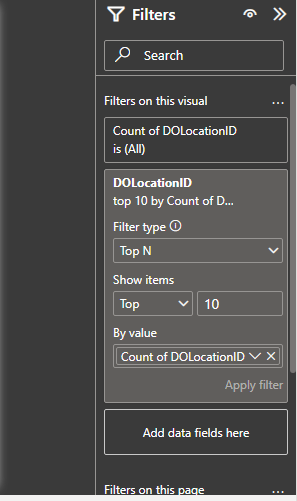
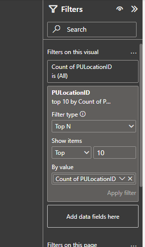
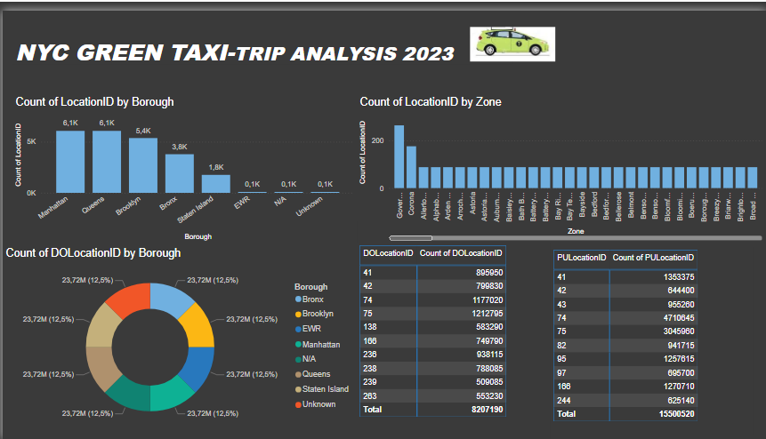

# nyc-green-taxi-analysis-report

## *Introduction*  
This Power BI project analyzes *NYC Green Taxi trips in 2023*, focusing on trip distribution across boroughs and zones. It provides insights into trip frequency, pickup and drop-off locations, and trends using interactive visualizations.  

### *Problem Statement *  

❓ *How can we identify the most popular pickup and drop-off locations for NYC Green Taxi trips?*  
✔ *By analyzing trip data, we found that Manhattan, Queens, and Brooklyn have the highest trip counts, with specific zones like Crown Heights, Astoria, and JFK Airport being key hotspots.*  

❓ *Are there imbalances between pickup and drop-off locations?*  
✔ *Yes, some zones have significantly more pickups than drop-offs (e.g., LocationID 41 with 1.3M pickups but only 898K drop-offs). This suggests areas where passengers frequently start their trips but do not return via taxi.*  

❓ *Which boroughs and zones have the lowest trip volumes, and why?*  
✔ *Staten Island, EWR (Newark Airport), and unknown zones have the lowest trip counts. This could be due to limited Green Taxi availability, lower demand, or alternative transport options in these areas.*  

❓ *How well is the taxi service distributed across different boroughs?*  
✔ *Drop-offs are evenly distributed across boroughs (each contributing about 12.5%), but pickup hotspots suggest that taxis are more concentrated in central NYC.* 

## *Skills Demonstrated*  
- *Data Sourcing & Transformation* (Azure Databricks, Power BI)  
- *Data Modeling* (Relational data connections)  
- *Data Visualization* (Charts, tables, and maps for insights)  
- *Power BI DAX & Measures* (Aggregations and calculations)
   
## *Data Sourcing*  
The dataset is sourced from *Azure Databricks*, containing records on Green Taxi trips in NYC, including:  
- *Trip locations* (Pickup & Drop-off Location IDs)  
- *Borough & Zone mapping*  
- *Taxi type classification*

#### *Transformations Applied:*  
1. *Filtering the Top 10 Locations:*  
   - The dataset originally contained a large number of unique pickup and drop-off locations.  
   - Applied a *Top 10 filter* on *PULocationID and DOLocationID* based on trip counts.  
   - This helps in focusing on the most significant zones for analysis.  

2. *Aggregation of Trip Counts:*  
   - Calculated the *total number of trips* per pickup and drop-off location.  
   - Ranked them to identify the *most frequently used locations*.  

3. *Reducing Data Volume for Performance Optimization:*  
   - Limiting data to the *top 10 locations* ensures better visualization performance.  
   - Reduces clutter in the reports, making insights more actionable.
    
  DROP LOCATION              |       PICK LOCATION  
 :..........................:|:...................:
                       
## *Modeling*  
This project uses a *flat-table approach* rather than a traditional star schema. The dataset consists of *three main flat tables*:  

1. *taxitype*:  
   - Contains taxi descriptions and trip types.  
   
2. *taxizone*:  
   - Maps *LocationID* to Boroughs and Zones.  
   - Includes service zones for additional classification.  

3. *tripsdata2023*:  
   - Includes *pickup (PULocationID) and drop-off (DOLocationID) location details*.  
   - VendorID to differentiate service providers.  

### *Flat-Table Approach Justification*  
- *Simplifies data integration* by keeping all relevant fields within a few tables.  
- *Avoids complex joins* in Power BI, improving performance for *large datasets*.  
- Suitable for *quick aggregations* and visual analysis.

### *Insights and visualizations from the Power BI Dashboard *  

The Power BI report provides key insights into *NYC Green Taxi trips in 2023*, focusing on trip distribution by borough and zone. Below are the main takeaways:  

### *1. High Trip Volume in Key Boroughs*  
- *Manhattan, Queens, and Brooklyn* show the *highest trip counts* (6.1K, 6.1K, and 5.4K trips, respectively).  
- *Staten Island, EWR (Newark Airport), and Unknown zones* have significantly lower trip counts (<1K).  
- This suggests that *most Green Taxi trips happen in central NYC areas, while trips to **outer zones are rare*.  

### *2. Zone-Level Drop-Off Patterns*  
- The *bar chart of "Count of LocationID by Zone"* shows that some zones (e.g., Crown Heights, Astoria, and JFK Airport) have much higher trip counts than others.  
- This indicates *high passenger demand in specific areas, likely due to **residential, commercial, or transit hubs*.  

### *3. Drop-off (DOLocationID) vs. Pickup (PULocationID) Counts*  
- Some *drop-off counts (DOLocationID) exceed pickup counts (PULocationID)* in specific locations.  
- Example:  
  - *DOLocationID 41 (approx. 898K trips)* vs. *PULocationID 41 (1.3M trips)* → More pickups than drop-offs.  
  - This suggests that certain locations are *major taxi hubs*, where people frequently get taxis but don’t return via taxi (e.g., airports, train stations).  

### *4. Even Distribution of Drop-offs Across Boroughs*  
- The *pie chart shows an even split (12.5%) across boroughs*, meaning no single borough dominates drop-off activity.  
- However, some boroughs might have *more short-distance trips*, leading to a higher volume of drop-offs in localized areas.  

### *5. Total Trip Counts*  
- *Total Drop-offs: ~8.2 million*  
- *Total Pickups: ~15.5 million*  
- The gap suggests *many pickups are not necessarily matched with drop-offs in the same dataset*, which could be due to missing data, multiple trip segments, or different reporting methodologies.

### *Conclusion & Recommendations*  

#### *Conclusion:*  
The *NYC Green Taxi Trip Analysis 2023* provides valuable insights into *trip distribution, demand hotspots, and operational patterns* across different boroughs and zones. Key findings include:  

1. *Manhattan, Queens, and Brooklyn* have the highest trip volumes, confirming their importance in the city's taxi network.  
2. *Certain zones (e.g., Crown Heights, Astoria, JFK Airport)* consistently show high trip counts, indicating strong passenger demand.  
3. *Drop-off and pickup imbalances* in some zones suggest areas where taxis are frequently used for one-way trips, possibly to major transit hubs.  
4. *A significant difference in total pickups (15.5M) vs. drop-offs (8.2M)* suggests potential data gaps or unbalanced taxi usage across zones.  
5. *Some boroughs, like Staten Island and EWR, have minimal taxi activity*, highlighting potential business expansion opportunities.  

#### *Recommendations:*  
✅ *Optimize taxi availability in high-demand zones* (JFK, Crown Heights, Astoria) to improve service efficiency.  
✅ *Investigate areas with low pickup/drop-off counts* (Staten Island, EWR) for potential market expansion.  
✅ *Analyze pricing and trip durations* to assess whether certain locations are more profitable than others.  
✅ *Enhance data accuracy and completeness*, particularly for missing or mismatched pickup/drop-off records.  
✅ *Consider demand-based pricing strategies* in zones with high trip activity to maximize revenue.

Thank you so much for following through

